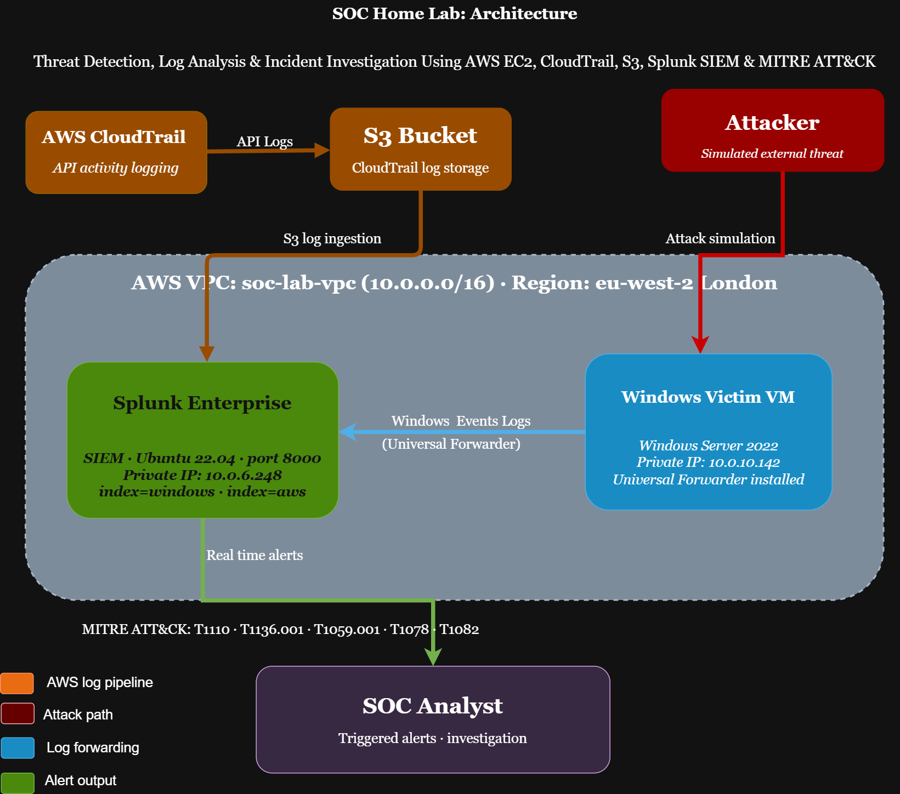

# SOC Home Lab: Threat Detection, Log Analysis & Incident Investigation Using AWS EC2, CloudTrail, S3, Splunk SIEM & MITRE ATT&CK


---

## Project Overview

**What I Built:**
A cloud-based Security Operations Centre deployed on AWS, complete with a live Windows endpoint, real-time log ingestion pipelines, and a Splunk SIEM configured to detect active threats as they happen. Every component mirrors what you would find in a real enterprise SOC environment.

**The Goal:**
To go beyond theory by simulating real attack behaviour across five MITRE ATT&CK techniques, then practising the full analyst workflow, log analysis, threat detection, alert triage, incident investigation, and drawing evidence-based conclusions from raw security event data.

**What Makes This Different:**
I architected the infrastructure from scratch, wrote every detection rule manually in Splunk SPL, troubleshot real configuration gaps, including enabling PowerShell Script Block Logging and Process Creation Auditing, and investigated every alert the way a working analyst would. The attacks were real. The detections were real. The investigation was real.

## **Tools & Technologies Used:**

| Category | Tools |
|---|---|
| Cloud Infrastructure | AWS EC2, AWS VPC, AWS IAM, AWS S3 |
| Cloud Logging | AWS CloudTrail |
| SIEM & Detection | Splunk Enterprise, Splunk SPL, Splunk Universal Forwarder |
| Target Endpoint | Windows Server 2022 |
| Server OS | Ubuntu 22.04 |
| Attack Simulation | PowerShell, Windows built-in tools |
| Threat Framework | MITRE ATT&CK |
| Diagramming | draw.io |

---

## Lab Architecture



---

| Component | Details |
|---|---|
| Cloud Provider | AWS (eu-west-2 — London) |
| Network | VPC — soc-lab-vpc (10.0.0.0/16) |
| SIEM | Splunk Enterprise on Ubuntu 22.04 EC2 |
| Endpoint | Windows Server 2022 EC2 (Victim Machine) |
| Cloud Logging | AWS CloudTrail → S3 → Splunk |
| Log Forwarding | Splunk Universal Forwarder |

I deliberately chose AWS over a local setup because real SOC environments live in the cloud. If I am going to build something for my portfolio, I want it to reflect the infrastructure I will actually be working with.

---

## Objectives

- Deploy a cloud-based SIEM from scratch with real log ingestion pipelines
- Integrate both endpoint logs and cloud infrastructure logs into a single platform
- Write custom detection rules in Splunk SPL mapped to MITRE ATT&CK
- Simulate real attack techniques on a live Windows target
- Investigate each attack as a SOC analyst would, reading logs, identifying IOCs, and drawing conclusions

---

## Project Phases

### Phase 1 & 2: Cloud Infrastructure Setup

I started by designing the network from the ground up. I created a custom VPC with appropriate subnets and security groups to isolate and control traffic between components. Two EC2 instances were provisioned, one Ubuntu server for Splunk and one Windows Server 2022 machine to serve as the target endpoint.


.jpg)


I paid careful attention to the security group rules by only allowing the strictly necessary ports.
---

### Phase 3: Splunk Enterprise Deployment & Log Forwarding

I installed Splunk Enterprise on the Ubuntu instance and configured it to receive logs on port 9997. I then deployed the Splunk Universal Forwarder on the Windows machine and pointed it at the Splunk server, establishing a real-time log pipeline between the two.


I configured the forwarder to collect from the Windows Security log channel, where all authentication events, account management activity, and process creation events are recorded. I later added the PowerShell Operational log channel during the attack simulation phase when I discovered it was not being collected by default. That kind of real troubleshooting is exactly what the lab is designed to surface.


---

### Phase 4: AWS CloudTrail Integration

I enabled AWS CloudTrail across my account and configured it to store logs in a dedicated S3 bucket. I then set up a Splunk S3 input using a least-privilege IAM user so Splunk could continuously pull CloudTrail logs into a separate index=aws.


This gave me dual visibility. I could now monitor both what was happening on the endpoint and what was happening at the cloud infrastructure level, from a single Splunk interface.

---

### Phase 5: Custom Detection Rule Engineering

I wrote five custom real-time detection rules in Splunk SPL, each targeting a specific attack technique and mapped to its MITRE ATT&CK ID. These were not default rules — I wrote every query myself, defined the trigger conditions, set the severity levels, and configured them to log to Triggered Alerts in real time.


| Rule | Detection Target | Event ID | MITRE Technique |
|---|---|---|---|
| Rule 1 | Brute Force Login Attempts | 4625 | T1110 |
| Rule 2 | Privilege Escalation via Valid Accounts | 4732 | T1078 |
| Rule 3 | New Admin Account Created | 4720 | T1136 |
| Rule 4 | Suspicious PowerShell Execution | 4104 | T1059.001 |
| Rule 5 | New Local User Account Created | 4720 | T1136.001 |

---

### Phase 6: Attack Simulation & SOC Investigation

This is the part that makes the lab real. I simulated five attack techniques directly on the Windows Victim machine using built-in Windows tools, no third-party exploit frameworks needed. For each attack, I documented the simulation, then switched to Splunk to investigate the generated alerts exactly as a SOC analyst would.

---

#### Attack 1: Brute Force (MITRE T1110)

I simulated 10 rapid failed login attempts against the Windows machine using a PowerShell script, generating repeated EventCode 4625 (Failed Logon) events. The key indicator here is timing; 10 failures in under 30 seconds is humanly impossible when typing manually, which immediately signals an automated attack.


**Splunk Investigation Query:**
```
index=windows EventCode=4625
| table _time, host, EventCode, Account_Name, Failure_Reason, Source_Network_Address
| sort -_time
```

What I found: 10 consecutive failures within seconds, targeting both the fakeattacker username and the default Administrator account. A classic attacker pattern of guessing common usernames before moving to custom ones.


---

#### Attack 2: Local Account Creation (MITRE T1136.001)

I created a backdoor local user account and immediately added it to the Administrators group, simulating the persistence technique attackers use to maintain access even if their initial foothold is removed.


**Splunk Investigation Query:**
```
index=windows EventCode=4720
| table _time, host, EventCode, name, SAMAccountName, src_user
| sort -_time
```

What I found: A single EventCode 4720 event confirming account creation, but what matters is context. An account appearing at this time with no corresponding change request or authorisation is an immediate red flag.


---

#### Attack 3: Encoded PowerShell Execution (MITRE T1059.001)

I executed a Base64-encoded PowerShell command, the same technique attackers use to hide malicious scripts from basic detection tools. Before running the simulation, I had to enable PowerShell Script Block Logging (disabled by default on Windows) and add the PowerShell Operational log channel to the Universal Forwarder configuration. That troubleshooting step added real depth to the project.


**Splunk Investigation Query:**
```
index=windows EventCode=4104
| table _time, host, EventCode, Message
| sort -_time
```

What I found: EventCode 4104 captured the decoded content of the encoded command, Splunk saw straight through the Base64 encoding, and logged what the command actually did. This is why Script Block Logging is one of the most powerful Windows security features for defenders.


---

#### Attack 4: Privilege Escalation (MITRE T1078)

I added the backdoor account to the local Administrators group, escalating its privileges to full system control. Windows logged this as EventCode 4732 (Member Added to Security-Enabled Local Group).


**Splunk Investigation Query:**
```
index=windows EventCode=4732
| table _time, host, EventCode, MemberSid, SAMAccountName, src_user
| sort -_time
```

What I found: The expanded event log told the complete story, the Administrator account acted, the target SID matched the backdoor account, and the timestamp correlated directly with the account creation event from Attack 2. That chain of correlated events is exactly what an analyst looks for when building an incident timeline.


---

#### Attack 5: System Reconnaissance (MITRE T1082)

I ran seven discovery commands in rapid succession — whoami, net user, net localgroup administrators, systeminfo, ipconfig /all, netstat -an, and tasklist, simulating an attacker mapping the environment after gaining access. I had to enable Process Creation Auditing (disabled by default) to capture these as EventCode 4688 events.


**Splunk Investigation Query:**
```
index=windows EventCode=4688
| where NOT match(New_Process_Name, "(?i)splunk")
| table _time, host, EventCode, New_Process_Name, Process_Command_Line
| sort -_time
```

What I found: All seven reconnaissance binaries executed within a 7-second window. No legitimate user runs that combination of commands that fast. The pattern alone is enough to trigger an escalation in any real SOC environment.


---

## Splunk Threat Detection Dashboard

To complete the project, I built a real-time SOC dashboard inside Splunk, consolidating all five attack detections into a single monitoring view. This mirrors what a tier-1 SOC analyst would use for continuous monitoring during a shift, with colour-coded severity indicators, a live event feed, and full MITRE ATT&CK technique mapping.


The dashboard includes:
- Colour-coded single-value counters for new accounts, privilege escalation events, and PowerShell executions
- Brute force failed login attempts plotted as a bar chart over time
- Pie chart showing the most targeted accounts during the attack simulation
- Full attack timeline with all five MITRE ATT&CK techniques plotted as a line chart
- MITRE ATT&CK detection summary table with technique name, severity rating, description, and event count
- Live security event feed showing the 20 most recent alerts with technique and severity columns

---

## Key Takeaways

The technical setup matters, but what I actually learned is how to think. Every alert I investigated forced me to ask the same questions a real analyst asks: What happened? Who did it? When? Is this normal for this machine? What came before and after? The SIEM is just the tool; the thinking is the job.

I also discovered that real environments require troubleshooting. PowerShell Script Block Logging was not enabled. Process Creation Auditing was off. The Universal Forwarder was not collecting from the PowerShell log channel. None of that was in the instructions. I had to identify the gap and fix it. That problem-solving is what the lab is really testing.

**Critical Windows Event IDs I now recognise on sight:**

| Event ID | Meaning |
|---|---|
| 4625 | Failed Logon — brute force indicator |
| 4624 | Successful Logon — baseline and breach confirmation |
| 4720 | User Account Created — persistence indicator |
| 4732 | Member Added to Group — privilege escalation indicator |
| 4104 | PowerShell Script Block — execution and evasion indicator |
| 4688 | Process Created — discovery and execution indicator |

---

## Tools & Technologies

- **AWS** — EC2, VPC, S3, IAM, CloudTrail
- **Splunk Enterprise** — SIEM, SPL query language, real-time alerting
- **Splunk Universal Forwarder** — endpoint log collection agent
- **Windows Server 2022** — target endpoint
- **Ubuntu 22.04** — Splunk server OS
- **PowerShell** — attack simulation
- **MITRE ATT&CK** — threat framework and technique mapping
- **draw.io** — architecture diagram

---

## Repository Structure

```
soc-home-lab/
│
├── README.md
├── architecture/
│   └── soc-lab-architecture.png
├── screenshots/
│   ├── phase-2-infrastructure/
│   ├── phase-5-detection-rules/
│   └── phase-6-attack-simulation/
└── detection-rules/
    ├── rule1-brute-force.txt
    ├── rule2-new-account.txt
    ├── rule3-privilege-escalation.txt
    ├── rule4-powershell-execution.txt
    └── rule5-reconnaissance.txt
```

---

## Connect With Me

I am actively looking for SOC Analyst opportunities. Feel free to reach out.

*This lab was built entirely by me, from infrastructure to investigation. Every configuration decision, troubleshooting step, and analyst conclusion documented here reflects hands-on work — not theory.*
